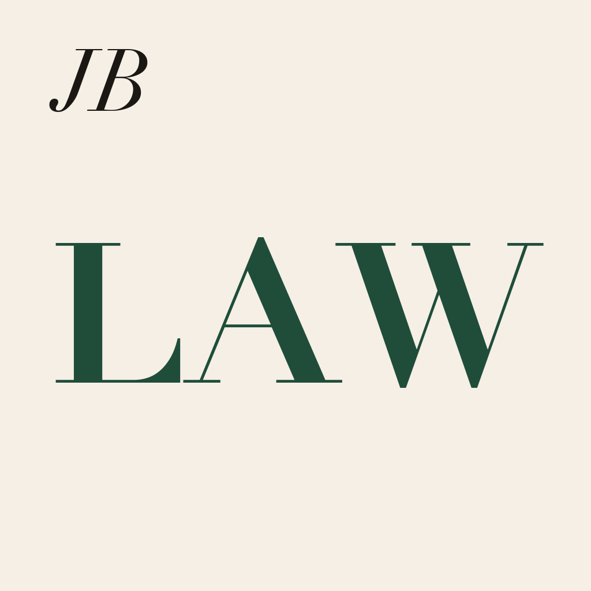
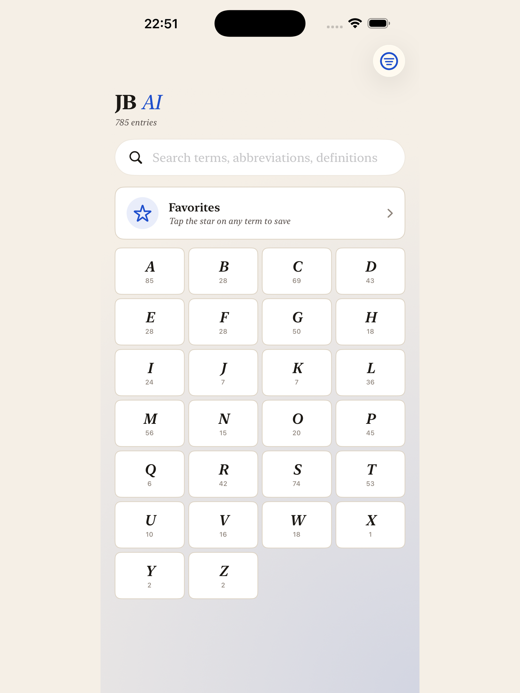
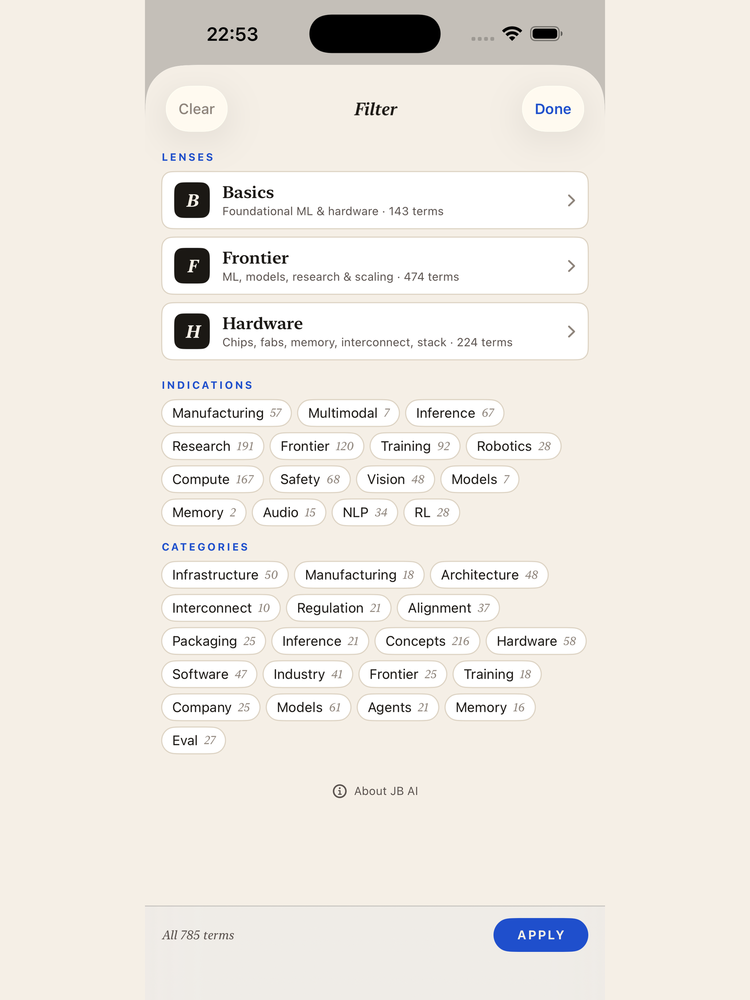
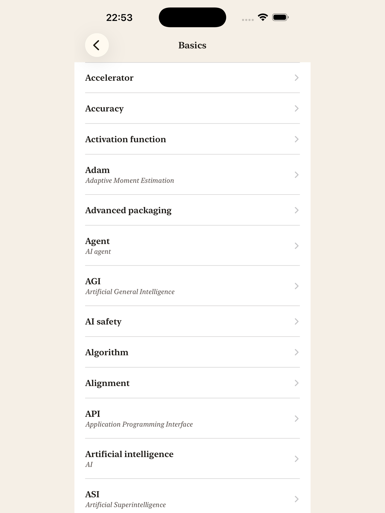
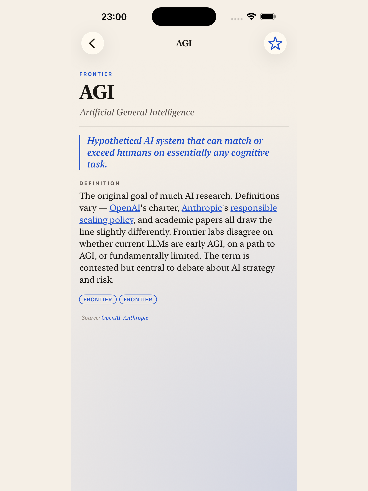
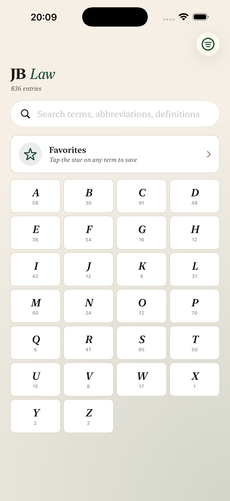
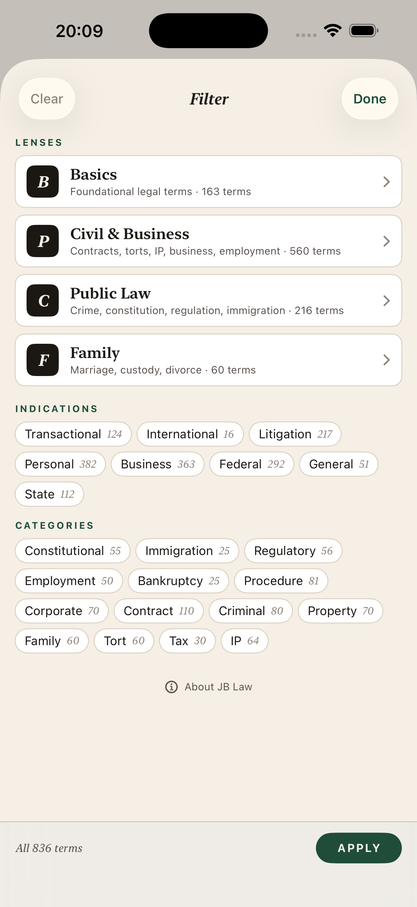
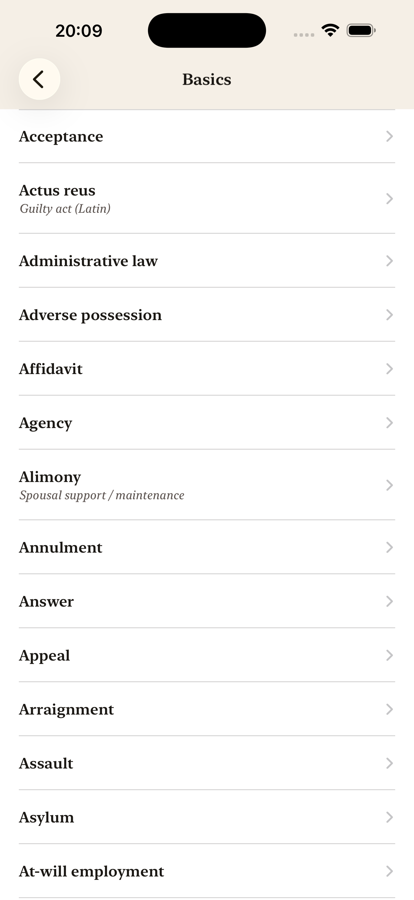
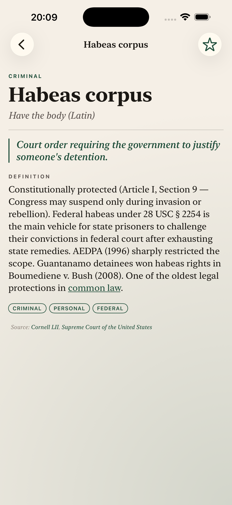

# JB Glossaries — iOS

Three native SwiftUI reference apps that turn dense professional jargon into clean, searchable, italic-typed cards. Built as a single XcodeGen workspace with one shared engine and three industry-specific corpora.

| Pharma | AI | Law |
|:---:|:---:|:---:|
|  |  |  |
| 324 terms | growing | 836 terms |
| Oncology + drug mechanisms | AI / ML concepts | US law (14 categories, 4 lenses) |

---

## JB Pharma

A pocket reference for the language that shows up in oncology decks, label discussions, and pharma news — mutations, mechanisms of action, modalities, indications. Two-axis filter (indication × category), oncology-first.

<p align="center">
  
</p>

- [Support](https://fromarkzoo.github.io/JBGlossary-iOS/support.html) · [Privacy](https://fromarkzoo.github.io/JBGlossary-iOS/privacy.html)

## JB AI

The same engine, retuned for the AI/ML vocabulary — agents, model architectures, training regimes, the stuff that fills frontier-lab posts.

<p align="center">
  
  
  
  
</p>

- [Support](https://fromarkzoo.github.io/JBGlossary-iOS/ai_support.html) · [Privacy](https://fromarkzoo.github.io/JBGlossary-iOS/ai_privacy.html)

## JB Law

836 US-law terms across 14 categories, with four reading lenses (Basics, Civil & Business, Public, Family) so first-year material and practitioner-grade terms don't drown each other out.

<p align="center">
  <video src="https://github.com/FromArkZoo/JBGlossary-iOS/raw/main/screenshots/jb-law/preview.mp4" width="280" controls muted autoplay loop playsinline></video>
</p>

<p align="center">
  
  
  
  
</p>

- [Support](https://fromarkzoo.github.io/JBGlossary-iOS/law_support.html) · [Privacy](https://fromarkzoo.github.io/JBGlossary-iOS/law_privacy.html)

---

## How it's built

One workspace, three targets, one shared engine. Each app pairs an industry-specific JSON corpus with the same SwiftUI reader: italic-first typography, two-axis filter, A–Z navigation, full-text search, share sheet.

```
Sources/                          shared engine (models, views, design system)
Targets/Pharma/Resources/         pharma corpus + icon + colour
Targets/AI/Resources/             AI corpus + icon + colour
Targets/Law/Resources/            law corpus + icon + colour
project.yml                       XcodeGen spec (three schemes)
```

### Run a target

```bash
xcodegen generate
open JBGlossary.xcodeproj         # pick scheme: Pharma / AI / Law → ⌘R
```

### Add or edit terms

Each app reads a flat `glossary.json` of `{letter, term, full, definition, category, indication?}`. Drop a new entry in, rebuild, the store re-decodes on launch.

---

Built and authored by [James Browne](https://github.com/FromArkZoo).
