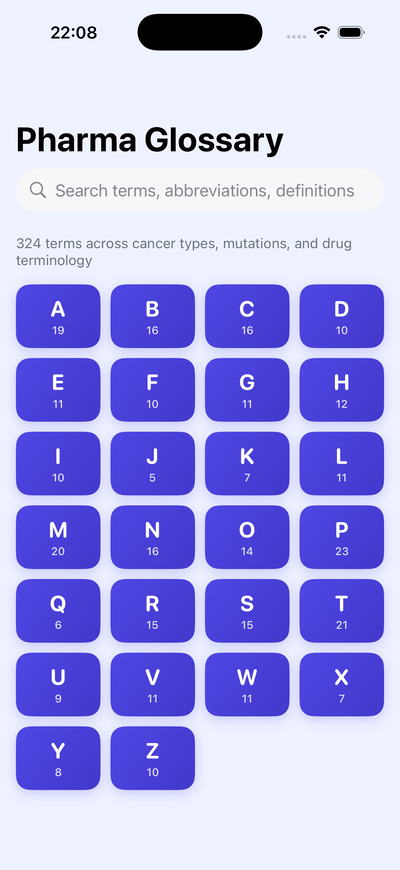

# Pharma Glossary — iOS

Native SwiftUI port of the Python tkinter pharma glossary. 324 terms across 26 letters.

<p align="center">
  
</p>

## Run on simulator

```bash
xcodegen generate                         # only after editing project.yml
open PharmaGlossary.xcodeproj             # then ⌘R in Xcode
```

## Run on your iPhone

1. Plug in iPhone, trust the computer.
2. Open `PharmaGlossary.xcodeproj`.
3. Select the **PharmaGlossary** scheme → your iPhone as destination.
4. **Signing & Capabilities** → set Team to your Apple ID. Bundle ID `com.jamesbrowne.PharmaGlossary` must be unique on your account; change the prefix in `project.yml` if Xcode complains.
5. ⌘R. First launch will prompt you to trust the developer certificate in **Settings → General → VPN & Device Management**.
6. Free Apple ID builds expire after 7 days — re-deploy from Xcode to extend. Paid Developer ($99/yr) gives 1-year provisioning.

## Adding terms

Edit `PharmaGlossary/Resources/glossary.json` (flat array of `{letter, term, full, definition}`). Rebuild — `GlossaryStore` re-decodes on launch.

## Layout

- `PharmaGlossaryApp.swift` — app entry, wires `GlossaryStore` and tint
- `Models/Glossary.swift` — `Term` model + `GlossaryStore` loader/search
- `Views/RootView.swift` — alphabet grid + `.searchable` results
- `Views/LetterView.swift` — terms for a letter
- `Views/TermDetailView.swift` — definition card + share button
- `DesignSystem/Colors.swift`, `Typography.swift` — `PGColors`, `PGFont`
- `Resources/glossary.json` — data
- `project.yml` — XcodeGen spec (mirrors CycleJames-iOS)
